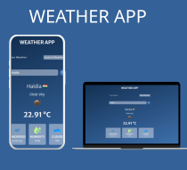

<h1 align="center">Weather App</h1>

  

## About

The Weather App is a simple web application that allows users to access real-time weather information for their current location or search for weather details in any city worldwide. This project uses HTML, CSS, and JavaScript to create an intuitive and user-friendly interface for weather data retrieval.

## Features

### 1. Current Weather Display

Upon opening the app, users are presented with the current weather information for their location. The main elements of this display include:

- City name and country flag.
- Weather description.
- Weather icon representing the current conditions.
- Temperature in Celsius.
- Wind speed.
- Humidity percentage.
- Cloudiness percentage.

### 2. Switch Tabs

Users can easily switch between two tabs: "Your Weather" and "Search Weather."

- "Your Weather" tab displays the user's current weather based on their location.
- "Search Weather" tab allows users to input a city name and retrieve its weather information.

### 3. Location Access

The app requests location access from the user. If granted, it retrieves the user's coordinates and displays their local weather. If denied or unavailable, users can manually search for a city's weather.

### 4. Search Weather

Users can search for weather information in any city by typing the city name and clicking the search button. The app then fetches and displays the weather data for the specified location.

## How It Works

1. The app uses the [OpenWeatherMap API](https://openweathermap.org/api) to fetch weather data.
2. When users grant location access, the app retrieves their coordinates and fetches the local weather information.
3. Users can manually search for weather by typing a city name and submitting the search form
4. The app displays weather details, including temperature, wind speed, humidity, and cloudiness, along with relevant icons and flags.

## Getting Started

To run this Weather App locally, follow these steps:

1. Clone this repository to your local machine.
2. Open the `index.html` file in a web browser.
3. The app will request location access. Grant access to see your local weather or manually search for a city's weather.
